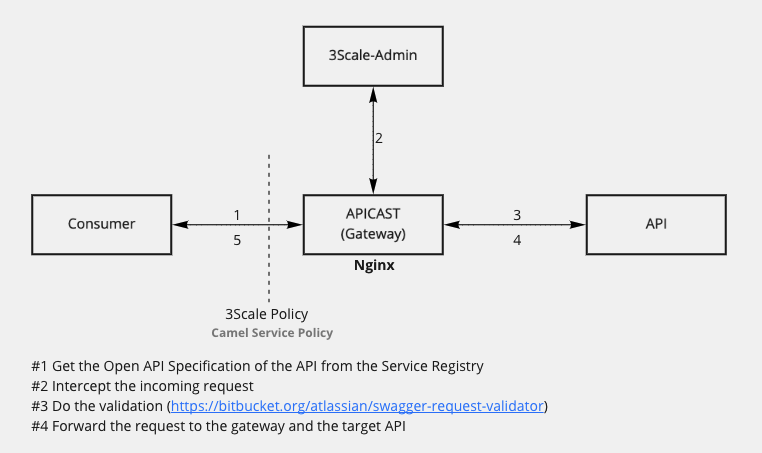
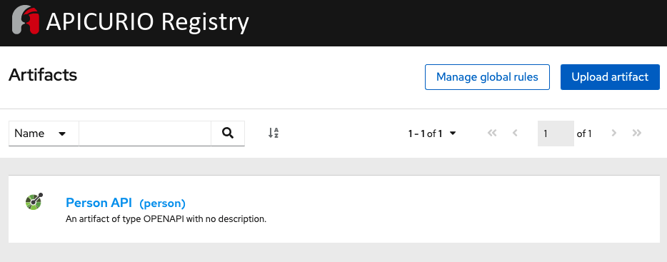
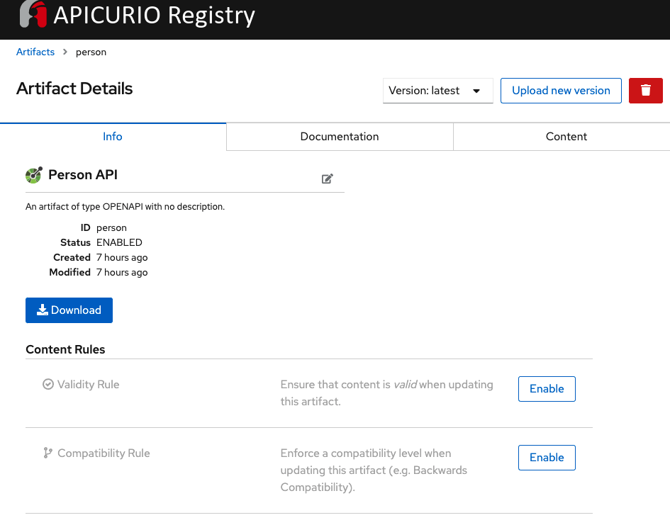
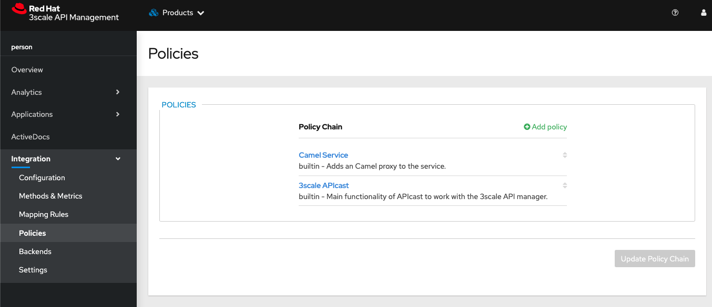
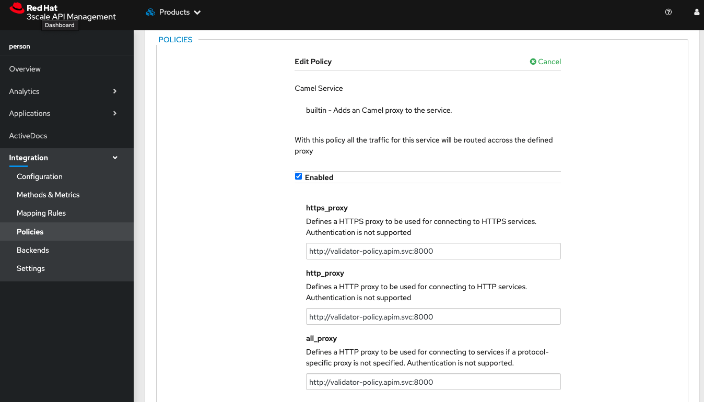

= 3Scale Validator Policy

== Overview

. Get the Open API Specification of the API from the Service Registry
. Intercept the incoming request
. Do the validation (https://bitbucket.org/atlassian/swagger-request-validator)
. Forward the request to the gateway and the target API

== Demo Setup 

=== Apicurio Registry

Upload the `person-openapi.json` file to the Service Registry

=== Setup the Policy in 3Sscale

== Running the policy locally

Run 

    cd person-api
    mvn quarkus:dev

Test 

    export http_proxy=http://localhost:8000
    
    # Create a user 
    curl -v "http://localhost:8080/person" -H "Cookie: redhat, apim" -H 'Content-Type: application/json' -d '{"id": "125", "name": "Teste", "phone": "551195423423", "city": "Brasilia", "state": "DF", "age": 30 }'

    # Get all users
    curl -v "http://localhost:8080/person" -H "Cookie: redhat, apim" -H 'Content-Type: application/json'

    # Test the validation (age as String) should raise an error
    curl -v "http://localhost:8080/person" -H "Cookie: redhat, apim" -H 'Content-Type: application/json' -d '{"id": "125", "name": "Teste", "phone": "551195423423", "city": "Brasilia", "state": "DF", "age": "30" }'
    